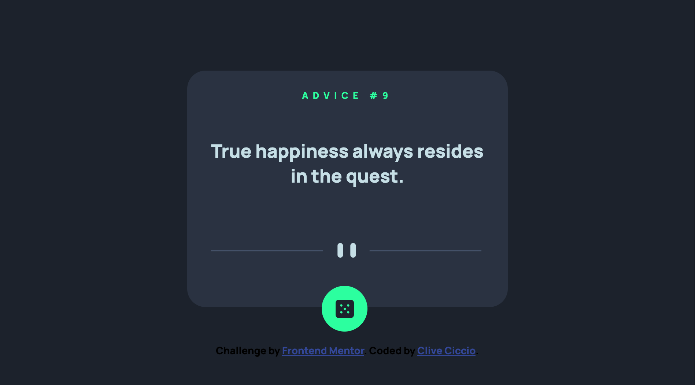

# Frontend Mentor - Advice generator app


## Welcome! 👋


- [Overview](#overview)

Thanks for checking out this front-end coding challenge.

[Frontend Mentor](https://www.frontendmentor.io) challenges help you improve your coding skills by building realistic projects.

**To do this challenge, you need a basic understanding of HTML, CSS and JavaScript.**

- [The challenge](#the-challenge)

## The challenge

The challenge was to build a advice generator app using the [Advice Slip API](https://api.adviceslip.com) and get it looking as close to the design as possible.

You can use any tools you like to help you complete the challenge. So if you've got something you'd like to practice, feel free to give it a go.

Your users should be able to:

- View the optimal layout for the app depending on their device's screen size
- See hover states for all interactive elements on the page
- Generate a new piece of advice by clicking the dice icon

- [Screenshot](#screenshot)




- [Links](#links)

- Solution URL: (https://github.com/clivepato93/advice-generator)
- Live Site URL: (https://clivepato93.github.io/advice-generator/)


- [My process](#my-process)

### Built with

- Semantic HTML5 markup
- CSS custom properties
- Flexbox
- Mobile-first workflow
- JS

  - [What I learned](#what-i-learned)

  I done a recap of how to make API requests and how to consume promises using fetch and promises

```js

const getAdvice = function(id){

    let request = id?`https://api.adviceslip.com/advice/${id}`:`https://api.adviceslip.com/advice`;

    fetch(`${request}`).then(function (response) {
        return response.json();
    }).then(function (data) {
        // Destructing of object done here easier then doing data.slip
        const {slip} = data;
        // call to the render function 
        renderHTML(slip)        
    })
}
```

- [Author](#author)

Feel free to check me out on 

- Frontend Mentor - [@clivepato93](https://www.frontendmentor.io/profile/clivepato93)
- Twitter - [@ciccio_ct93](https://www.twitter.com/ciccio_ct93)


